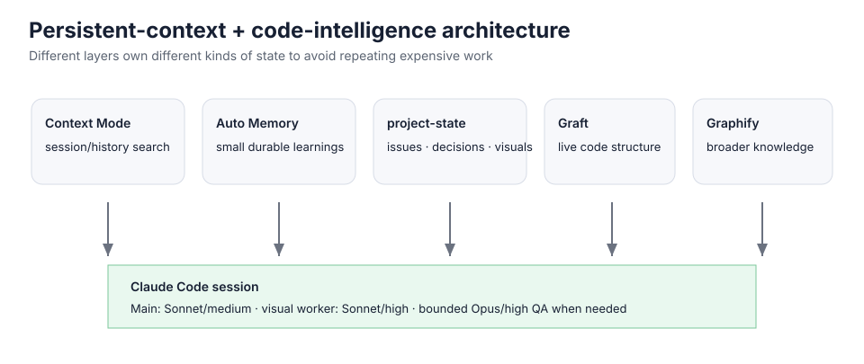

# Claude Code Smart Bootstrap

> **Persistent context, token-aware code exploration, reusable visual references, and fast self-repair for Claude Code on Linux/WSL.**

`claude-smart-bootstrap.sh` is a multi-user production bootstrap for Claude Code. It is designed for developers who run Claude Code across multiple Git repositories and want to reduce repeated setup, repeated code exploration, repeated screenshot analysis, and unnecessary package/plugin work.

## What problem does it solve?

Without a coordinated setup, long-running Claude Code work can repeatedly spend time/context on:

- re-reading a repository from scratch;
- re-uploading and re-analyzing the same design board;
- forgetting why a previous fix/decision was made;
- manually reminding Claude which workflow/tools to use;
- reinstalling/checking packages and plugins that are already healthy;
- carrying a giant conversation just to preserve continuity.

This project gives those concerns separate owners:



## What it configures

- ✅ [Claude Code](https://github.com/anthropics/claude-code) native CLI for selected Linux users
- ✅ Sonnet + medium as the stable main-session default
- ✅ Auto Memory
- ✅ 350,000-token auto-compaction calculation window
- ✅ deferred MCP tool loading / tool search
- ✅ [Context Mode](https://github.com/mksglu/context-mode) for searchable persistent session history
- ✅ [Graft](https://github.com/trailhq/Graft) for live code structure, callers, dependencies, blast radius
- ✅ [Graphify](https://github.com/Graphify-Labs/graphify) for broader code/docs/config knowledge when useful
- ✅ [Caveman](https://github.com/JuliusBrussee/caveman) plugin for concise output
- ✅ `claude-project-state` for solved issues, decisions/rationale, visual references
- ✅ content-addressed visual cache (SHA-256 + compact spec/crops)
- ✅ Android/ADB local visual tooling
- ✅ Sonnet/high visual implementation worker
- ✅ bounded Opus/high visual QA escalation
- ✅ automatic per-repo Graft wiring
- ✅ smart `.claudeignore` rules for generated graph/cache files
- ✅ offline-first SMART-REPAIR mode
- ✅ comma-separated multi-user targeting
- ✅ deep read-only `--verify-only`
- ✅ explicit `--update` mode

## Who is this useful for?

Especially useful for people who:

- maintain multiple local Git repositories;
- use Claude Desktop Code and/or Claude CLI on Linux/WSL;
- want continuity across new conversations without keeping one huge chat forever;
- do screenshot-driven Android/mobile UI work;
- repeatedly debug the same project over days/weeks;
- care about avoiding unnecessary package downloads and tool-output churn.

The visual pieces are Android/mobile-oriented, but the context, memory, Graft, Graphify, MCP, model and smart-repair layers are useful for general software work too.

## Quick start

```bash
git clone https://github.com/IGProd/Claude-Code-Smart-Bootstrap.git
cd Claude-Code-Smart-Bootstrap
chmod +x claude-smart-bootstrap.sh

sudo ./claude-smart-bootstrap.sh --users root,alice
```

Multiple users are comma-separated:

```bash
sudo ./claude-smart-bootstrap.sh --users root,alice,bob
```

### Default user behavior

If `--users` is omitted, the script targets:

1. `root`
2. `SUDO_USER` when present and different from root

So this normally works from a regular sudo-capable account:

```bash
sudo ./claude-smart-bootstrap.sh
```

From an existing root shell, use an explicit list when you also want another account:

```bash
./claude-smart-bootstrap.sh --users root,alice
```

Environment-variable alternative:

```bash
sudo env CLAUDE_BOOTSTRAP_USERS="root,alice,bob" \
  ./claude-smart-bootstrap.sh
```

Preview the resolved list:

```bash
sudo ./claude-smart-bootstrap.sh --users root,alice --show-targets
```

## Modes

```bash
# Normal use: repair missing/broken pieces, skip healthy pieces
sudo ./claude-smart-bootstrap.sh --users root,alice

# Deep read-only verification
sudo ./claude-smart-bootstrap.sh --users root,alice --verify-only

# Intentionally refresh packages/plugins/vendor sources
sudo ./claude-smart-bootstrap.sh --users root,alice --update

# Help / version
./claude-smart-bootstrap.sh --help
./claude-smart-bootstrap.sh --version
```

`--verify-only` and `--update` are mutually exclusive.

## Why SMART-REPAIR is different

A healthy rerun does **not** go back to the internet just to ask whether everything is still “latest”.

```text
Claude Code healthy       → SKIP; no installer/network call
Graphify healthy          → SKIP; no uv/package/network action
Graft healthy             → SKIP; no npm registry/install action
mobile visual stack       → SKIP; no git fetch/pip reinstall
plugins locally healthy   → no Claude plugin-runtime startup
Graft MCP locally healthy → no Claude MCP-runtime startup
settings correct          → UNCHANGED
SessionStart hook current → SKIP
repo inventory current    → no full filesystem tree scan
```

`--update` is the explicit opt-in for rolling package/plugin/vendor updates.

## Persistent context: who owns what?

| Layer | Responsibility |
|---|---|
| **[Context Mode](https://github.com/mksglu/context-mode)** | Searchable session/history retrieval and large-output virtualization |
| **Auto Memory** | Small durable learnings |
| **claude-project-state** | Confirmed solved issues, decisions/rationale, visual references |
| **[Graft](https://github.com/trailhq/Graft)** | Current code structure, symbols, callers/dependencies |
| **[Graphify](https://github.com/Graphify-Labs/graphify)** | Broader code/docs/config knowledge when useful |
| **Visual cache** | Exact-image reuse, compact design specs, crops and local diff workflow |

The goal is **complementary layers**, not forcing every task through every tool.

## Reusable design/image references

For images that will be used more than once, keep a stable local copy in the project:

```text
my-app/
└── design-reference/
    ├── sheet.png
    ├── home.png
    └── stats.png
```

First use:

```text
Use and register design-reference/home.png as the canonical home-screen reference.
```

Later:

```text
Match the home screen to design-reference/home.png.
```

The file content is fingerprinted. Exact pixels can reuse the stored spec/crops; if the file changes but keeps the same filename, the hash changes and it is treated as new/near instead of silently reusing stale data.

Use chat attachments for one-off images. Use stable local project paths for references you expect to revisit.

## Model strategy

```text
Main conversation      → Sonnet / medium
Visual implementation  → Sonnet / high subagent
Hard visual QA         → Opus / high, bounded escalation
```

The parent model/effort stays stable to avoid unnecessary cache churn while harder visual work is isolated.

## Where it writes

Depending on what needs repair, the script may manage:

```text
/etc/claude-code/managed-settings.d/
~/.claude/
~/.claude/settings.json
~/.claude/CLAUDE.md
~/.claude/hooks/
~/.claude/skills/
~/.claude/agents/
~/.claude/project-state/
~/.local/bin/
~/.profile
~/.bashrc
```

Per repository:

```text
graft/
.claude/skills/graft/
.claudeignore managed block
Graphify post-commit hook
```

## Upstream projects

Claude Code Smart Bootstrap coordinates existing tools; it does not replace them. Visit the upstream repositories for their own documentation, releases, licenses, and issue trackers.

| Project | Repository | Used here for |
|---|---|---|
| Claude Code | [anthropics/claude-code](https://github.com/anthropics/claude-code) | Main coding-agent runtime |
| Context Mode | [mksglu/context-mode](https://github.com/mksglu/context-mode) | Persistent/searchable context and large-output virtualization |
| Graft | [trailhq/Graft](https://github.com/trailhq/Graft) | Live code structure and dependency/caller exploration |
| Graphify | [Graphify-Labs/graphify](https://github.com/Graphify-Labs/graphify) | Broader code/docs/config graph support |
| Caveman | [JuliusBrussee/caveman](https://github.com/JuliusBrussee/caveman) | Concise response behavior |
| Node.js | [nodejs/node](https://github.com/nodejs/node) | Runtime required by parts of the stack |
| uv | [astral-sh/uv](https://github.com/astral-sh/uv) | Python/tool environment management |

## Requirements / safety

Designed for **Linux / WSL** with root/sudo access.

The script can install software and modify user configuration. Review it before running it. First-time install or repair of a missing dependency may require network access.

For public/professional use:

- test in a disposable VM/WSL environment first;
- keep backups of important Claude settings;
- do not schedule `--update` blindly unless rolling updates are intentional;
- remember that Context Mode, Graft, Graphify, Caveman, Claude Code, Node.js, uv and other dependencies are third-party projects with their own licenses/terms.

## What it does not promise

This project does **not** guarantee:

- zero token usage;
- unlimited Claude plan quota;
- perfect recall of every historical turn;
- exact pixel parity across different fonts/devices/renderers;
- permanent compatibility with every future third-party release.

It aims to reduce **avoidable repeated work** and make repair/verification explicit.

## Validate the repository

```bash
bash tests/static-check.sh
```

CI runs the same static checks on push and pull request.

## Documentation

- [Architecture](docs/ARCHITECTURE.md)
- [Security notes](SECURITY.md)
- [Changelog](CHANGELOG.md)

## License

MIT for this repository's own code/documentation. Third-party software retains its own license and terms.
