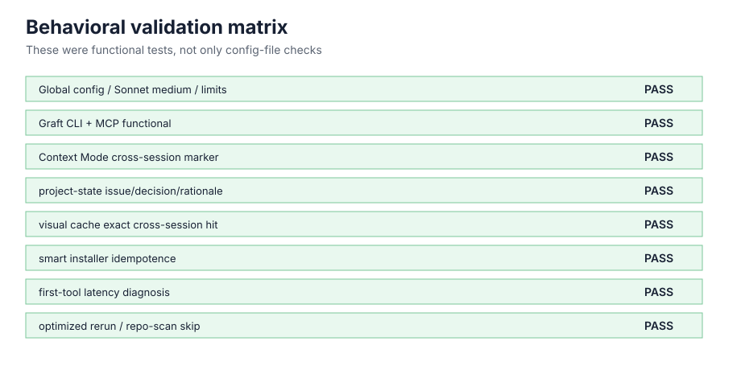
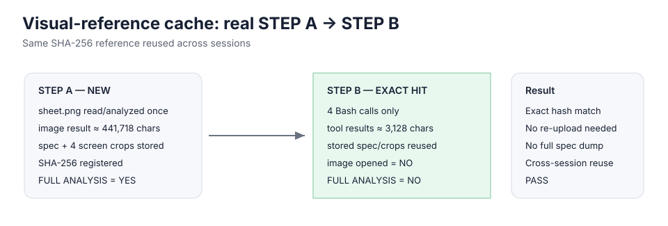
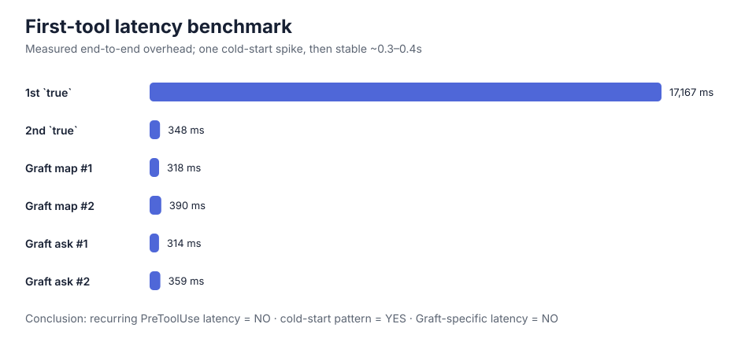
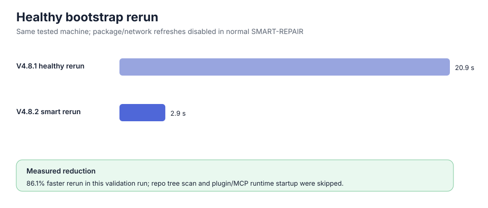

# Behavioral Test Results

These results are **sanitized measurements from the development validation run**. They are included so readers can distinguish “configuration exists” from “behavior actually worked”.

They are not universal performance promises: hardware, WSL version, Claude Code version, plugins and network conditions can change the numbers.

## Validation matrix

| Test | What was proven | Result |
|---|---|---|
| Global settings | Sonnet/medium, 350k compaction window, Auto Memory, subagent caps | PASS |
| Graft | MCP query, `graft map`, `graft ask`; no segfault/connection close | PASS |
| Context Mode | exact marker recovered from a different conversation | PASS |
| project-state | issue + decision + rationale recovered across sessions | PASS |
| visual cache | exact SHA hit reused spec/crops without re-opening image | PASS |
| smart bootstrap | healthy packages/plugins skipped | PASS |
| PreToolUse diagnosis | first-call spike isolated as one-time cold start | PASS |
| optimized rerun | plugin/MCP runtime and repo tree scan skipped | PASS |

## Graft functional test

Measured behavior:

- Graft MCP code query: PASS
- `graft map`: PASS
- `graft ask`: PASS
- segmentation fault: NONE
- `CONNECTION_CLOSED`: NONE
- non-zero exit: NONE
- tested Graft CLI version: `0.16.0`

An early `graft map` appeared to take ~16.84 s wall time while Graft itself was fast. The controlled benchmark below later proved that the delay belonged to the first Bash/PreToolUse cold-start, not Graft.

## Cross-session continuity

A unique marker was introduced in one conversation and explicitly **not** saved to project files/project-state/Auto Memory. A new conversation recovered the exact marker from Context Mode persistent history.

That proved cross-session retrieval behavior, not merely plugin installation.

## project-state persistence

A temporary solved issue and durable decision were stored, then recovered from a new conversation using only `claude-project-state`.

A schema gap was discovered during testing: a decision `Reason:` was not initially persisted because the canonical field was `rationale`. The bootstrap was fixed to canonicalize `reason` / `why` → `rationale`, then the cross-session test passed.

## Visual cache: new vs exact hit

### STEP A — new reference

The design sheet was not present in the visual store.

- cache lookup: empty
- full image read/analyzed: yes
- approximate image tool-result representation: `441,718` characters
- compact design spec: stored
- screen crops: `4`
- reference SHA-256: stored

### STEP B — exact cached reference, new conversation

The same SHA-256 was found.

- tool calls: `4` Bash calls
- approximate tool-result characters: `3,128`
- image opened/analyzed: **no**
- full spec dumped to context: **no**
- crop contents dumped: **no**
- stored spec/crops reused: **yes**

This is the behavior the cache is meant to provide: **expensive first analysis, cheap exact reuse**.

## Controlled first-tool latency benchmark

| Call | Measured overhead |
|---|---:|
| first `true` | 17,167 ms |
| second `true` | 348 ms |
| `graft map` #1 | 318 ms |
| `graft map` #2 | 390 ms |
| `graft ask` #1 | 314 ms |
| `graft ask` #2 | 359 ms |

Conclusion from that run:

- recurring PreToolUse latency: **NO**
- cold-start pattern: **YES**
- Graft-specific latency: **NO**

The transcript timestamps used for end-to-end measurement had coarse granularity, so the small ~300–390 ms values should not be overinterpreted. The ~17 s first-call spike was large enough to be unambiguous.

## Bootstrap rerun benchmark

The bootstrap was made progressively more idempotent.

Measured healthy rerun on the tested machine:

- before fast local plugin/MCP + repo-scan marker optimization: **20.887 s**
- after optimization: **2.90 s**

The later run showed:

- no Claude installer/network call;
- no Graphify package refresh;
- no npm Graft install;
- no mobile-stack fetch/reinstall;
- no Claude plugin runtime call;
- no Claude MCP runtime call;
- no full repository tree scan;
- fast local verification only.

## Raw measured data

See [`test-results/measured-results.json`](test-results/measured-results.json).

The JSON is intentionally sanitized and should be treated as **test evidence from one environment**, not a guaranteed benchmark for all machines.
